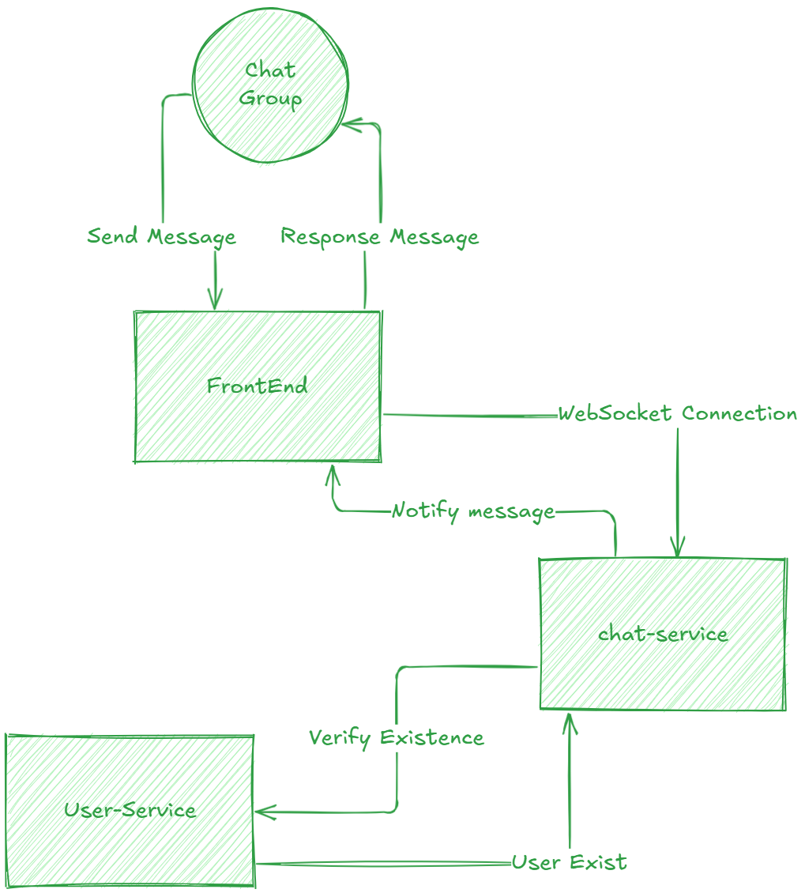

# Trascendence

## Microservice
Ya estan configurados los contenedores de docker 

### Microservices Use Case Diagram


### Comando para ejecutar
```bash
docker compose up -d
```
### Swagger
Chat Service
```http
http://localhost:3000/docs
```
User Service
```htpp
http://localhost:3010/docs
```
Auth Service
```http
http://localhost:3020/docs
```


---

## Chat useCase


## Licencia


```

```
